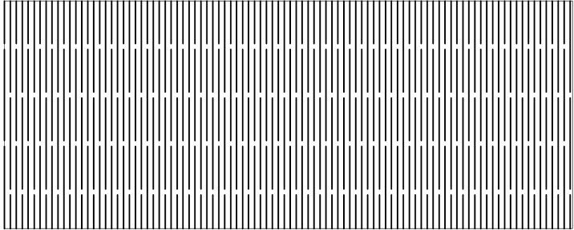
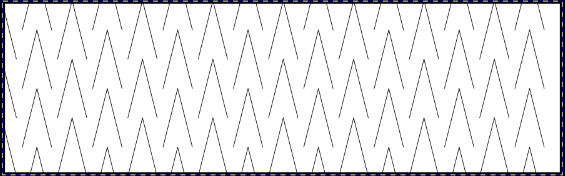
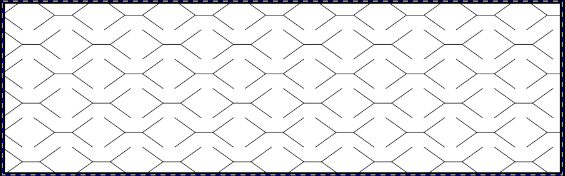
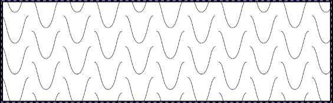
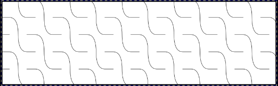
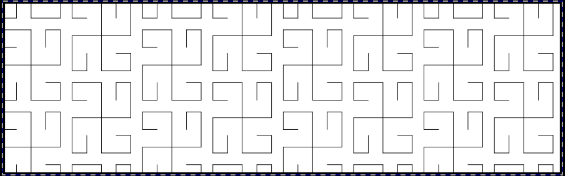
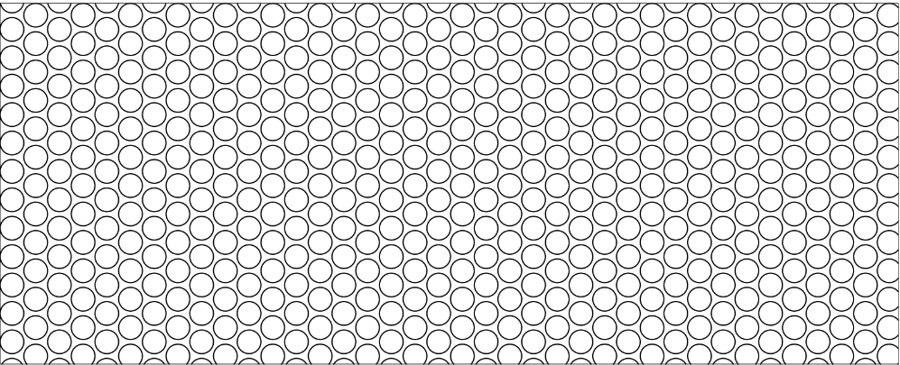
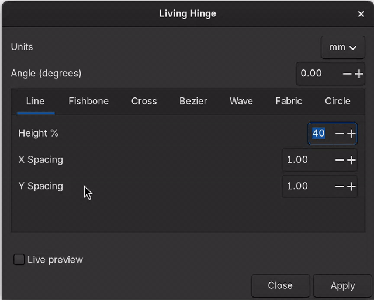
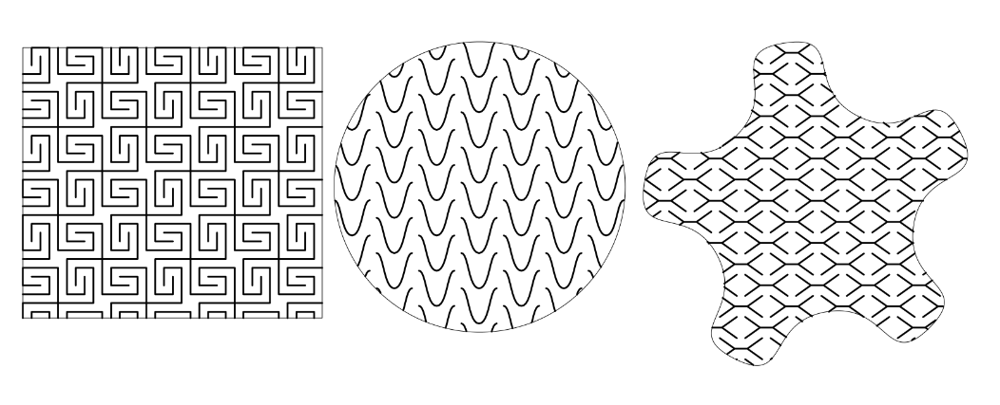

# KM Living Hinge

A highly opinionated Inkscape extension to generate living hinge patterns for laser-cut flexures. Several different patterns are available.  Select any shape in your document, run the extension, choose the tab corresponding to the pattern you want to use, and apply.

## Manual Installation
1. Create the subdirectory km-living-hinge/ in your Inkscape extensions folder:
   - Linux: `~/.config/inkscape/extensions/`
   - Linux (Flatpak): `~/.var/app/org.inkscape.Inkscape/config/inkscape/extensions/`
   - Linux (Snap): `~/snap/inkscape/current/.config/inkscape/extensions/`
   - macOS: `~/Library/Application Support/org.inkscape.Inkscape/config/inkscape/extensions/`
   - Windows: `%APPDATA%\\inkscape\\extensions\\`
2. Copy files from this repo into your km-living-hinge/ directory.
3. Restart Inkscape. The extension appears under `Extensions > Knox Makers > Laser > Living Hinge`.

## Patterns

| Pattern | Preview |
| --- | --- |
| Line |  |
| Fishbone |  |
| Cross |  |
| Bezier |  |
| Wave |  |
| Fabric |  |
| Circle |  |

## Screenshots

Patterns truncate to shapes.

## Acknowledgements
Inspiration, examples, and code came from:

The original Living Hinge extension for Inkscape.  
https://github.com/siteswapjuggler/Inkscape_LivingHinge

Hatchfill from Evil Mad Scientists and their Eggbot extensions.  
https://github.com/evil-mad/EggBot/

The wonderful Meerk40t and its Laser Tools of which each of these patterns exist (and more).  
https://github.com/meerk40t

